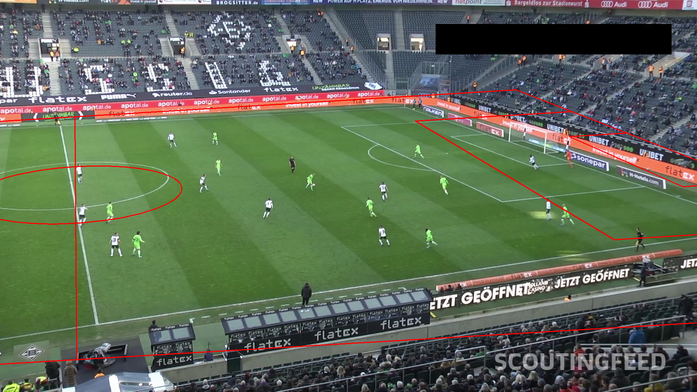

# Soccer player tracking and formation analysis

Takes a broadcast clip of a soccer match and produces per-player
tracking data, team assignments, top-down pitch positions and a
formation estimate (4-4-2, 4-3-3, ...) for each phase of possession.

Built on top of two reference implementations:
[Darkmyter/Football-Players-Tracking](https://github.com/Darkmyter/Football-Players-Tracking)
(YOLOv8 + ByteTrack detection/tracking, trained model weights) and
[pateddamiano/soccer_tracker](https://github.com/pateddamiano/soccer_tracker)
(pipeline structure, K-means team assignment, optical-flow camera
motion, view transform). The formation detection stage and the
per-frame camera homography chain are new here.

## Pipeline

1. **Detection** -- YOLOv8 fine-tuned on the Roboflow
   [football-players-detection](https://universe.roboflow.com/roboflow-jvuqo/football-players-detection-3zvbc)
   dataset (classes: ball, goalkeeper, player, referee). Trained
   weights from the Darkmyter project are used as-is
   (`models/yolov8m-640-football-players.pt`); `train_detector.py`
   reproduces the training if needed.
2. **Tracking** -- ByteTrack (via `supervision`) keeps per-player IDs
   across frames. The ball is not tracked (single object, weak
   detector) -- best detection per frame plus linear interpolation.
3. **Team assignment** -- K-means on jersey pixels: 2-cluster K-means
   segments each player crop into jersey vs background, then a second
   K-means over all jersey colors splits the players into two teams.
   Assignment is a per-track majority vote over several frames.
4. **Camera motion** -- background features (stands, boards) are
   tracked with Lucas-Kanade optical flow; each consecutive frame pair
   gets a RANSAC homography, composed over time so any frame maps back
   to the calibration reference frame. Handles panning *and* zoom,
   unlike the translation-only reference approach -- necessary even on
   the sample clip, which zooms out ~2x mid-clip.
5. **Pitch homography** -- a manually calibrated homography (see
   [docs/calibration.md](docs/calibration.md)) maps reference-frame
   pixels to meters on a standard 105x68 pitch.
6. **Possession phases** -- ball is assigned to the nearest player
   within a threshold; the per-frame team-in-possession signal is
   median-smoothed and segmented into possession phases.
7. **Formation detection** -- per phase and team, average outfield
   player positions are normalized and matched against formation
   templates with the Hungarian algorithm; the lowest-cost template
   wins. Goalkeepers are excluded.

## What works reliably and what does not

Measured on the bundled test setup (30 s single-camera Bundesliga clip,
see "Results" below), not aspirational:

| Stage | Status |
|---|---|
| Player detection | Reliable (this is the best-performing stage) |
| Ball detection | Weak -- the known limitation of this detector (mAP50 ~0.4 for the ball class); expect gaps filled by interpolation |
| Tracking IDs | Mostly stable; IDs switch when players cluster or leave frame |
| Team assignment | Reliable when kits contrast; check the annotated video before trusting it |
| Camera motion | Good on continuous shots incl. zoom; **breaks on camera cuts** |
| Pitch homography | Needs manual calibration per video; meter-level error at best, worse far from calibration points (lens distortion is not corrected) |
| Possession phases | Heuristic; inherits ball-detection weakness |
| Formation detection | Only meaningful when ~10 outfield players per team have valid pitch positions; broadcast framing often shows fewer. Treat low `players_used` results as noise |

The homography/field-registration step is the fragile one. It assumes a
single continuous camera shot. Footage with cuts, replays, or extreme
zoom needs to be trimmed to one shot first, and each shot needs its own
calibration. Do not run this on full broadcast footage and expect
sensible coordinates.

## Results on the test clip

Everything below was measured on `08fd33_4.mp4` -- a 30 s, 750-frame,
single-camera, no-cuts 1080p Bundesliga clip from the [DFL Bundesliga
Data Shootout](https://www.kaggle.com/competitions/dfl-bundesliga-data-shootout)
(bundled with the soccer_tracker reference repo) -- running CPU-only
(~13 min detection with yolov8m).

**Detection/tracking**: 20.1 players tracked per frame on average
(range 14-23; there are 23 people on the pitch including officials).
46 unique track IDs over 30 s for ~21 continuously-visible people, i.e.
roughly one ID switch per person, mostly during the mid-clip zoom-out.
Player detection is solidly usable. The ball was detected in only **37%
of frames** (80% in the first, zoomed-in seconds; far less when wide) --
the rest is linear interpolation.

**Team assignment**: correct on every spot-checked track (white vs
green kits). One referee that YOLO misdetected as a player was caught
by the jersey-color outlier cutoff and left unassigned -- worth knowing
that before that fix, the ref polluted possession stats materially.

**Camera motion + homography**: the calibration itself reprojects at
0.79 m on its own points (frame 600). The weak spot is the
frame-to-frame chain: landmarks mapped from frame 0 all the way to
frame 600 land 38-227 px off (~4-15 m depending on pitch region). So
pitch coordinates are meter-accurate near the calibration frame and
degrade the further (in time) a frame is from it. For clips longer
than ~30 s, calibrate several keyframes rather than one.

**Possession**: 55/45 frame split, 6 segments of >= 1 s. Inherits the
ball-detection weakness -- during wide shots the "ball" is often an
interpolated guess.

**Formations** (from `output/formations/08fd33_4.json`): every phase
had all 10 outfield players with valid coordinates, thanks to the wide
angle. For the one long possession phase (12.6 s), the defending team
classified as 5-3-2 with a reasonable margin (cost 0.128 vs 0.130 for
5-4-1) and the attacking team as 4-4-2 in a near-tie with 3-4-3
(0.157 vs 0.170). Shorter segments (1-3 s) produced unstable,
low-margin labels. Honest read: defensive shape on long phases is
credible; in-possession shape from a few seconds of average positions
is closer to a guess, and 30 s of footage is simply not enough to call
a team's formation. The per-phase `ranking` costs are in the JSON so
close calls are visible instead of hidden.



## Setup

```
python -m venv .venv
.venv\Scripts\pip install -r requirements.txt
```

Model weights go in `models/`. The checkpoints trained by the Darkmyter
project can be fetched with:

```
pip install gdown
gdown --folder https://drive.google.com/drive/folders/1-1r2psRgW7JRSEykRmvUYEY31ufuxiDb -O models
```

## Usage

Start with a short (30-60 s) clip from a single camera angle, no cuts.

```
# 1. one-time manual calibration for the video (see docs/calibration.md)
python calibrate.py data/videos/myclip.mp4 --frame 600

# 2. run the pipeline
python run_pipeline.py data/videos/myclip.mp4 --calibration calibration/myclip.json
```

Outputs:

- `output/tracking/<clip>/tracks.pkl` -- raw tracks (bbox, team, pitch
  position per frame), plus the cached camera-motion chain
- `output/tracking/<clip>/<clip>_annotated.mp4` -- video with player
  ellipses/IDs colored by team, ball marker, possession label and a
  top-down minimap (the quickest way to eyeball whether the homography
  is sane)
- `output/formations/<clip>.json` -- possession segments and per-phase
  formation estimates with match costs and player counts

Without `--calibration`, the pipeline still runs detection, tracking
and team assignment; it skips pitch coordinates and formations.

## Layout

```
soccervision/        pipeline modules (detection, tracking, teams,
                     camera_motion, pitch, possession, formation, annotate)
run_pipeline.py      end-to-end CLI
calibrate.py         interactive homography calibration tool
train_detector.py    YOLOv8 fine-tuning on the Roboflow dataset
models/              detector weights (gitignored)
calibration/         per-video homography calibration JSON
data/videos/         input clips (gitignored)
output/tracking/     tracks, caches, annotated videos
output/formations/   formation reports
docs/                calibration guide
```
