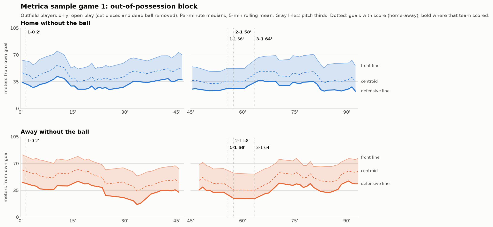

# Team shape analysis: how it is built and why

This covers the full-match shape analysis (`analyze_shape.py`), what each
piece does, and the reasoning behind every choice, so the same approach
can be rebuilt on other data.

```
python scripts/download_metrica.py --game 1     # ~66 MB, once
python analyze_shape.py --game 1 --open         # ~30 s on CPU, opens the report
python -m pytest tests                          # 6 tests, <1 s
```

Outputs land in `output/shape/metrica_game1/`:

| File | What it is |
|---|---|
| `report.html` | **The match report for staff**: open it in any browser, no Python needed |
| `block_height.png` | Each team's out-of-possession block over the match (static image) |
| `summary.csv` | Median shape per team, phase and 15-minute window |
| `shape_by_frame.csv` | Every sampled frame: all metrics plus phase, for your own analysis |



## The data flow

```
Metrica CSVs ──► metrica.py ──► players table  ─┐
 (tracking,       (loader)      frames table   ─┼─► shape.py ──► per-frame shape ──► summary / plot
  events)                                        │   (metrics)     + phase label
                                                 │
video pipeline ──► (converter, not built yet) ───┘
provider feed  ──► kloppy ──► (same two tables) ─┘
```

Three separate layers: **loading** (source-specific), **metrics**
(source-agnostic), **presentation** (plot/tables). The next sections
explain each decision in the order the data passes through.

## 1. One common format for every tracking source

`metrica.py` converts everything into two tables:

- **players**: one row per player per frame: `period, frame, time_s, team, player, is_gk, x, y`
- **frames**: one row per frame: `period, frame, time_s, ball_x, ball_y, possession, in_play, set_piece`

**Why:** at a club you'll get tracking from several places (a provider
like SkillCorner or Second Spectrum, Wyscout/Hudl exports, your own
video pipeline) and each has its own file format. If the metric code
reads a provider's raw format, you rewrite it for every source. With
one internal format you write one loader per source (often ~50 lines)
and the metrics never change. `kloppy` exists for exactly this reason
and outputs a very similar long table. This is how most analytics
teams structure their code.

**Why "long" (one row per player per frame) rather than "wide" (one
column per player)?** Players come and go (substitutions, red cards,
broadcast tracking losing people off-screen). In long format a missing
player is just a missing row, and grouping by `(frame, team)` works the
same whether 10 or 7 players are present. Wide format needs a column
for every player who ever appears, most of them empty.

**Coordinates:** meters, x along the pitch 0-105, y across 0-68 from the
top touchline, the same system as the video pipeline (`pitch.py`). Metrica gives
0-1 normalized coordinates and doesn't publish the real pitch size, so
105x68 is assumed (legal pitches at that level are within ~1 m of it).
Meters, not normalized units, so that "block 35 m from goal" means
something to a coach.

## 2. Finding the keeper (and the bug it caused)

Metrica's data is anonymized and has no positions. The keeper is found
as **the player whose average distance from the halfway line is
largest**, since nobody else spends 90 minutes near a goal line.

The first version used "average x furthest from halfway" instead, and it
was wrong in a way worth remembering: teams swap ends at half-time, so a
keeper's average x across the match is about 52 m, right at halfway.
The code picked an outfield player as the keeper and counted the real
keeper as a defender. The symptom: defensive lines of 8-14 m even *in
possession* in the first half, and front lines of 95+ m in the second half.
Numbers like that are impossible for a real team, which is how it was
caught (see "Sanity checks" below). The fix and a regression test are in
`metrica.py` / `tests/test_metrica.py`.

**Lesson for any source:** anything computed "over the match" has to
account for the change of ends at half-time.

## 3. Depth from your own goal

All vertical metrics are measured as **distance from the team's own goal
line** (`shape.add_depth`). Which goal a team defends is decided per
period: the team whose keeper stands further left defends the left goal.
If keepers aren't tagged (common in broadcast tracking), the teams'
average positions are compared instead.

**Why:** raw x is useless for comparing teams or halves: "x = 70"
means a high line for one team and a deep one for the other, and flips
at half-time. Measured from your own goal, 35 m means the same thing
for both teams in both halves, and it's how coaches talk ("we
defended 35 m from goal").

## 4. The metrics (per frame, per team, outfield players only)

| Metric | Definition | What a coach reads from it |
|---|---|---|
| `def_line` | depth of the deepest outfield player | Defensive line height / offside line: high, mid or low block |
| `front_line` | depth of the most advanced outfield player | Where the first line of pressure starts |
| `centroid` | mean depth | Where the team "is" as a unit |
| `length` | front_line − def_line | Vertical compactness; 30-35 m out of possession is typical |
| `width` | y-spread | Horizontal compactness; teams narrow without the ball, widen with it |
| `area` | convex hull area | Overall compactness in one number |

**Why outfield only:** the keeper sits 5-15 m from goal all match and
would pull `def_line` and `centroid` toward goal without saying anything
about the block.

**Why the deepest player for the defensive line** (rather than, say, the
average of the back four): it needs no role labels (which player is a
centre-back?) and it's the offside line, which is what actually
limits space in behind. The downside is that one defender dropping
off drags it down. Medians over time (below) absorb most of that.

**Why metrics become NaN below 8 outfield players** (`min_players`): if
players are missing, width, length and area are silently
*underestimated*, which looks like a compact team when it isn't.
Metrica tracks everyone, so this rarely triggers here; on broadcast
tracking (the video pipeline) it will matter a lot. A missing number is
better than a wrong one.

## 5. Possession and phases from the event log

Shape only means something split by phase: a team's block *without*
the ball is a different object from its shape *with* it. Metrica's
tracking has no possession column, so `possession_from_events` derives
it from the event log.

**How:** events are turned into a list of change points, and each frame
takes the state of the most recent one (`np.searchsorted` does that
lookup for every frame at once):

| Event | Effect |
|---|---|
| PASS, SET PIECE, SHOT, RECOVERY, BALL LOST | that team has the ball, ball live |
| BALL OUT, shot ending in a goal or out of play, FAULT RECEIVED | ball dead until the next event (the restart) |
| last event of a period | ball dead |
| CHALLENGE | ignored: both teams log one for the same duel, so it doesn't say who ends up with the ball |

A BALL LOST keeps possession with the losing team until the opponent's
RECOVERY, because that's when the ball actually changes hands.

**Phases** (`shape.label_phases`): each (frame, team) becomes
`in_possession`, `out_of_possession`, `set_piece` or `dead_ball`. Corners
and free kicks open a 10-second `set_piece` window. **Why:** defending a
corner means everyone in the six-yard box, and those frames would drag
the "block height" down to ~5 m. Set-piece shape is a separate analysis.
Throw-ins and goal kicks are kept as open play.

**Goals** are detected from the event subtypes ending in `-GOAL`, and the
scorer is taken from **who kicks off next** (the team that conceded).
The first version only looked at SHOT events and missed a goal logged as
`BALL OUT / WOODWORK-GOAL` (the event's team was Home, but Home kicked
off after it, so it was an Away goal, likely a Home own goal). The kick-off
rule gets own goals right without needing to know what happened.

## 6. 5 frames per second

Metrica records 25 fps; the analysis keeps every 5th frame.
**Why:** a player moves at most ~2 m in 0.2 s, and shape metrics
describe the team over seconds, not fractions of a second. 5 fps gives
the same medians with 5x less work. (Speeds and accelerations, e.g.
for pressing intensity or runs, need more: 10-25 fps.)

## 7. Summaries: medians, 15-minute windows

`summarize` reports the **median** per team, phase, half and 15-minute
window (stoppage time folds into the last window of each half).
**Why medians:** a centre-back stepping out to press or a winger caught
upfield shifts a mean, but not the typical shape. **Why 15-minute
windows:** that's how match reviews are usually cut (and enough
out-of-possession time per window, 2-9 minutes here, to be stable).
Anything much shorter gets noisy fast.

The plot uses per-minute medians smoothed with a 5-minute rolling mean.
That's the same idea at a finer grain, tuned for a trend line.

## Sanity checks: how the bugs were caught

Neither bug above made the code crash; both produced plausible-looking
tables. They were caught by checking results against what real football
looks like. Run these checks on any new data source:

1. **Out-of-possession length ~30-35 m, width ~35-40 m.** Anything
   outside 20-50 m is suspicious.
2. **Width grows in possession** (here: ~36-40 m → ~45-55 m).
3. **Ball in play 55-65% of the match** (here 63%).
4. **The score matches the kick-offs**: every kick-off after the
   first of each half means a goal.
5. **Look at the plot.** A defensive line at 95 m is obvious in a chart
   and invisible in a 24-row table.

## Reading game 1 (an example of the write-up an analyst would do)

Final score 3-1 Home (2', 56' Away, 58', 64').

- **Home without the ball** held a mid block in the first half
  (defensive line ~27-37 m by window), then **dropped deeper at 1-0 early
  in the second half** (~22-27 m) and conceded at 56'. After going 2-1
  and 3-1 they defended higher again (~35 m, 63'-80') before dropping
  back to ~23 m for the last ten minutes, which is typical of seeing out
  a lead.
- **Away without the ball** started aggressively: defensive line ~40-45 m,
  centroid ~55-60 m for the first 25 minutes (a high block). They then
  dropped to ~17-28 m from 25-35'. Between 55' and 63', the spell in
  which Home scored twice, Away's block was at its deepest (~25 m),
  before pushing up to ~40-45 m chasing the game.
- Both teams are **~10 m narrower without the ball** than with it, and
  keep ~28-35 m from back line to front line out of possession: organised, compact
  blocks on both sides.

One match is one game state; before calling any of this a team's
"style", look at 3-5 matches (see the club-use notes).

## Rebuilding this on other data

1. **Get the two tables.** For a provider feed, `kloppy` loads
   Metrica, SkillCorner, Second Spectrum, Tracab, StatsPerform and more.
   Rename its columns to the ones above. For the video pipeline,
   write a converter from `tracks["players"][frame][track_id]`
   (`team`, `cls`, `position_pitch`) to rows of the players table.
2. **Get possession.** Events if you have them (adapt the rule table
   in section 5 to that provider's event names); otherwise ball-proximity
   like `possession.py` in the pipeline (noisier).
3. **Run `add_depth → frame_shape → label_phases → summarize`.** No changes needed.
4. **Run the sanity checks** before believing any number.

## The staff report

`soccervision/report.py` gathers everything the page shows (findings,
per-minute trends, average positions, the 15-minute table) into one
JSON blob, and `report_template.html` draws it with plain JavaScript and
SVG. **Why this split:** all the football logic stays in tested Python,
the page only draws, and each report is one file you can email or drop
in a shared drive with no server and no install.

- **Key findings** are rule-based sentences (`_findings`). A change under
  3 m between halves is reported as "similar", so noise isn't presented
  as a tactical change. Add rules there as you learn what staff ask for.
- **Average positions** (`shape.average_positions`) are drawn in each
  team's own frame (own goal left, attacking right), with players on
  for under 30% of a window left out and at most 10 outfielders kept,
  so a substitute and the player replaced don't both appear.
  Average positions always look more compact than any real moment; the
  page says so under the pitch maps.

## Known limitations

- Pitch size is assumed 105x68 for Metrica (≤ ~1 m error).
- Possession is event-derived: frames between a pass and its reception
  belong to the passer's team, and loose-ball moments go to whoever had
  it last.
- The set-piece window is a flat 10 s regardless of how quickly play
  settles.
- `def_line` uses one player; a line-by-line analysis (defensive line,
  midfield line, distance between lines) needs players grouped into
  lines first. That's the natural next metric.
